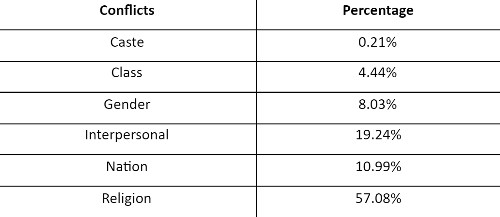
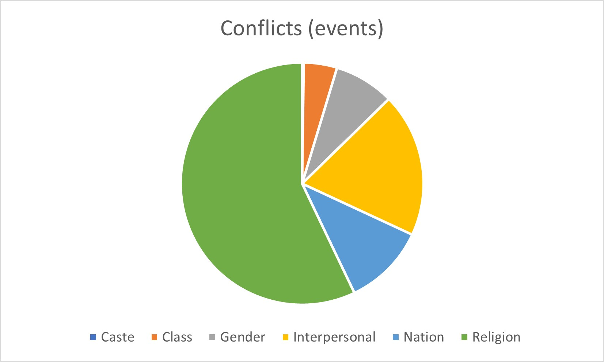
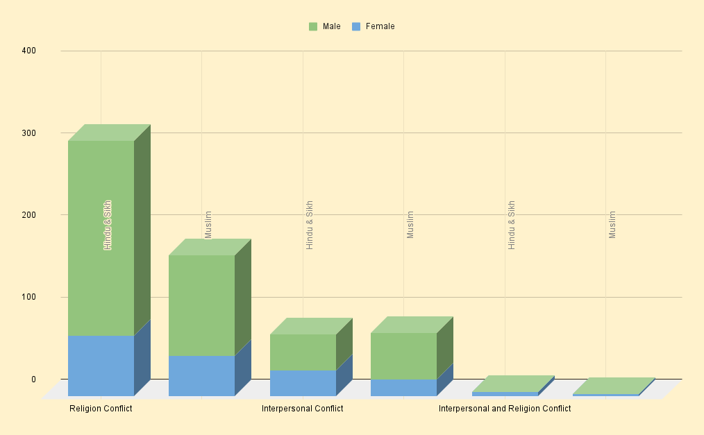

```{r setup, include=FALSE}
knitr::opts_chunk$set(echo = TRUE)
```

### Database Entries

Number of entities we entered for each kind with our accounts:

Added by IDs: "99" + “100”<br/>
Location: 3 + 3 = 6<br/>
Character: 33 + 3 = 36<br/>
Text: 4 + 1 = 5<br/>
Text Place: 9 + 2 = 11<br/>
Event: 52 + 48 = 100<br/>
Total: 103 + 57 = 160<br/>

In the beginning, we sat together and entered data simultaneously and later did it separately. However, we reviewed some entries of each other that we entered individually.

### Introduction

Partition of British India into two countries is considered as one of the biggest religion based separation, with a great human migration in history. Violence was at its peak during partition in British India, especially against women. Hindus & Sikhs and Muslims were attacking one another, and targeting women as a display of power. It is estimated that about 75,000 to 100,000 women were kidnapped and raped during the partition (Aftab et. al). People were perpetrating violence in groups, in an organized manner. However, in some cases the violence was caused by individuals. Therefore, we decided to explore how significant interpersonal enmities are in comparison to other conflicts. In this project, we studied the database of partition novels entered by a group of students on [heurist sydney] (https://heuristplus.sydney.edu.au/heurist/startup/). We decided to further our understanding of violence through predominantly two kinds of conflicts during this period, analyzing whether violence against women was more interpersonal or religion based.

### Research Question

Is religion a more dominant reason behind violence against women than interpersonal issues? Is religious violence more apparent for different religions?
 
We aimed to analyse how significant a role interpersonal conflicts played when compared to religion. For our analysis we operationalised the research question into following queries:

1. All events with religious or interpersonal conflict
2. Gender and religion of characters in these events

### Database Description

In this partition database, there are 46 texts in total which are predominantly short stories (see appendix for list), written by Kushwant Singh, Bhisham Sahni, Attia Hosain, Amrita Pritam, Mohinder Singh Sarna and Saadat Hasan Manto. It has 1447 events, 1026 characters where 230 are females and 796 are males belonging to various religions, primarily Muslim, Hindu and Sikh

#### Crosstab

<center>
Table 1: Crosstab of conflicts with different percentage

Figure 1: Pie chart showing crosstab of conflicts with different values
</center>

Clearly, religious and interpersonal conflict were the primary modes of conflict during partition, which matches what most would surmise.

### Analysis

Since one event can be categorised into several categories of conflicts, for our further analysis, (check the appendix for the pivot table) we decided to divide into three different categories -

1. Interpersonal: wherever interpersonal is selected and religion is not chosen in the conflict category. (Class|Interpersonal, Gender|Interpersonal, Interpersonal, Interpersonal|Nation)
2. Religion: wherever religion is selected and interpersonal is not chosen in the conflict category. (Nation|Religion, Religion, Religion|Caste, Religion|Gender, Religion|Nation, Religion|Gender|Class)
3. Interpersonal & Religion: wherever interpersonal and religion both are selected in the conflict categories. (Interpersonal|Gender|Religion, Religion|Gender|Interpersonal, Religion|Interpersonal|Class, Gender|Religion)

Out of 482 characters in events of religious conflict, 171 were Muslim and the rest were Hindu and Sikh. 28.66% and 23.47% of Muslims and Hindus & Sikhs were female respectively. This indicates that religion is not the primary reason behind violence against women during partition.

<center>Figure 2: Histogram</center>

### Conclusion

Overall, males characters are remarkably more involved in both kinds of conflicts than females, which is consistent with the fact that there are more male characters in all the texts in our database. Congruous to the widespread assumption, religion is pronounced as the primary reason behind conflicts, and not interpersonal. However, they have a significant part in events of conflict. Thus in many cases, violence against women is due to individuals’ personal issues during the partition. It is possible that partition was used as an excuse to play out old resentments as discussed.

Muslim women did not face significantly more violence than Hindu and Sikh women. This however is not what the literature around religious violence during partition suggests. In the book A Concise History of Modern India, Barbara Metcalf and Thomas Metcalf state that “perhaps twice as many Muslim as Hindu and Sikh women were taken” (abducted). Similarly, there are several discourses which believe Hindu and Sikh women faced greater violence than Muslim women. This research shows that all such discourses are baseless and are inherently biased.

### Reflection

A major benefit databases have over analysis using Voyant and R is that one would not have to spend too much time cleaning the data. Furthermore, the data has been entered in a granular manner, the analysis becomes easier. Since the data has been entered by us, the quality of analysis is greatly improved. However, this means that any conclusions drawn from the data  is dependent on the people’s judgment.

During the process of entering events to the database, we are converting a story, which has a flow into discrete events. This removes the interdependence of one event with another.
 
In our project, just because a character is involved in a conflict, it does not necessarily imply that they were harmed. Therefore, in some cases, female characters might be the ones who are committing a cruel act. However, this problem can be resolved, as one can modify the format by adding two sub points; who is hurted and who hurted. Even then, conflict does not mean it entails violence, an event could be just a minor argument or fights of opinions only.

### Appendix

https://docs.google.com/spreadsheets/d/1HeyW8zXIbCakydEk6reufNB_0p3seJbJrExBRJmBVj0/

### Citation

1. Aftab, Tahera (30 November 2007). Inscribing South Asian Muslim Women: An Annotated Bibliography & Research Guide (Annotated ed.). Brill. p. 224.
2. Ian Talbot; Gurharpal Singh (23 July 2009). The Partition of India. Cambridge University Press. pp. 2–3.
3. Barbara D. Metcalf; Thomas R. Metcalf (24 September 2012). A Concise History of Modern India. p 226, Cambridge University Press.
4. Butalia, U. (n.d.). The Violence of Partition. Deshbandhu College. Retrieved from https://www.deshbandhucollege.ac.in/pdf/resources/1587612047_H(H)-VI-The_violence_of_Partition.pdf